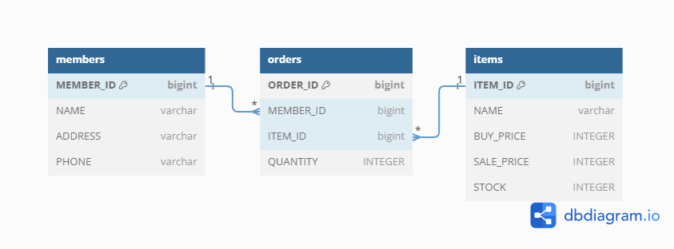
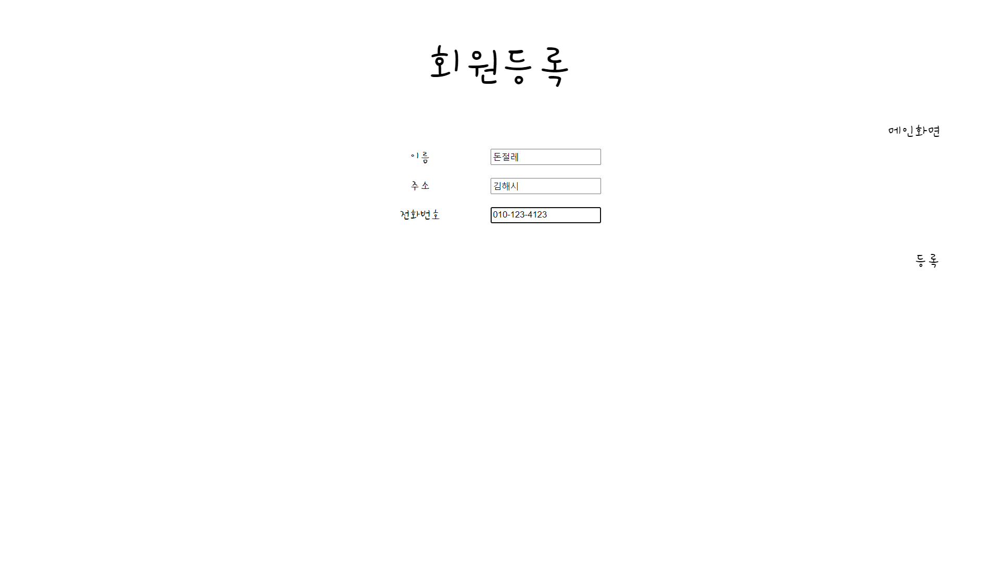
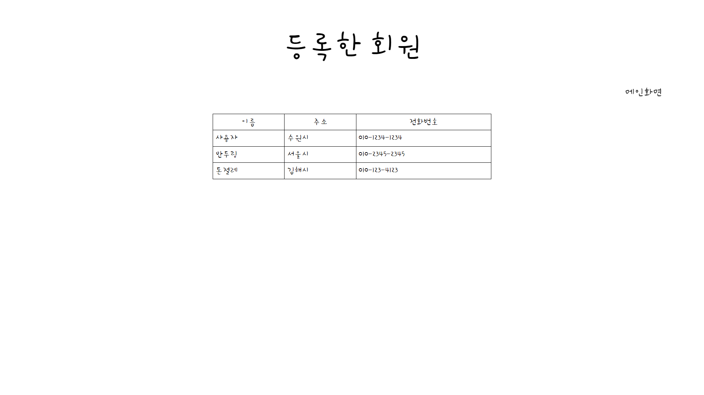
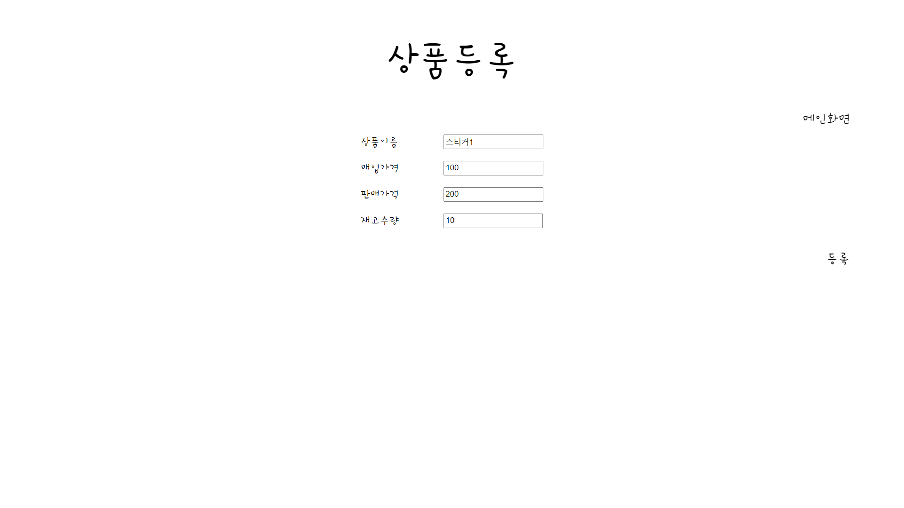
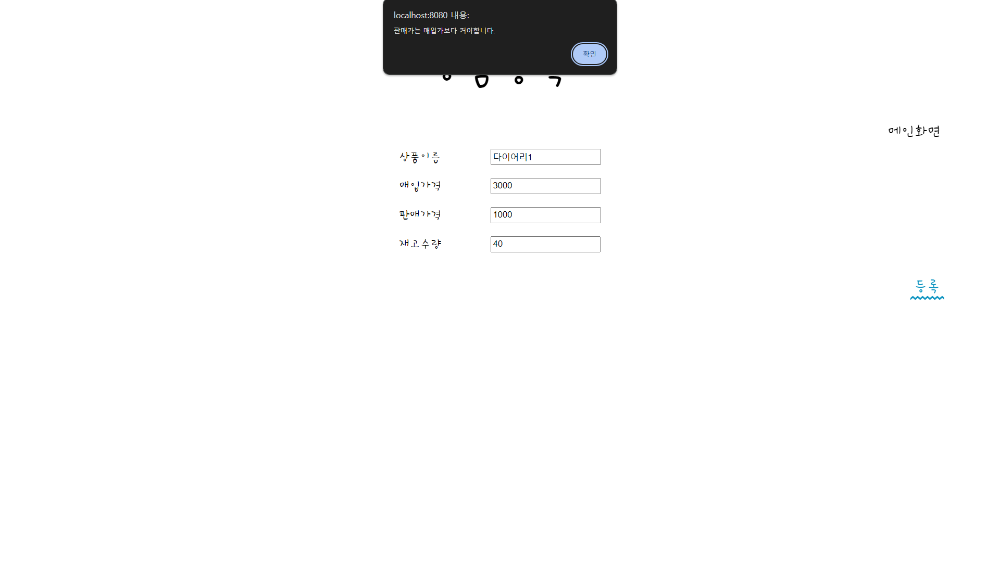
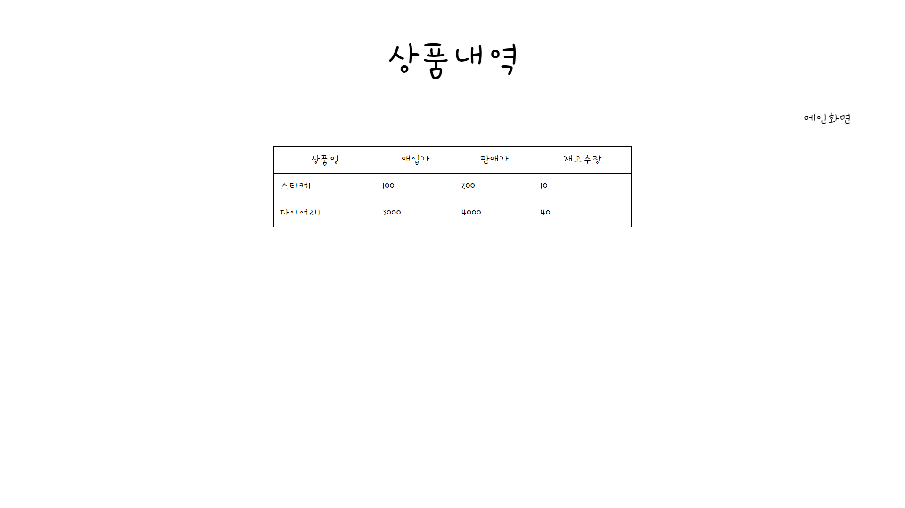
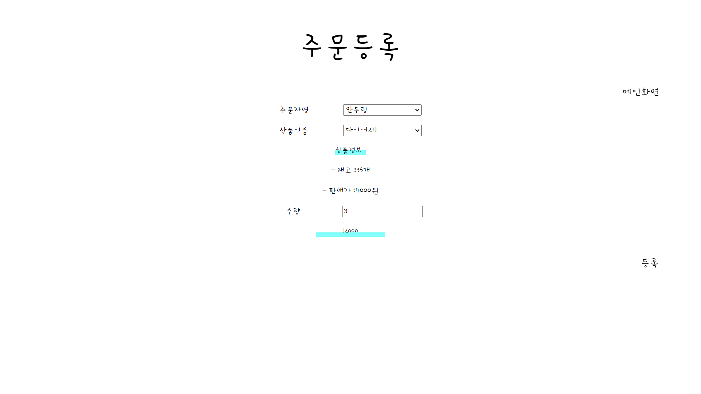
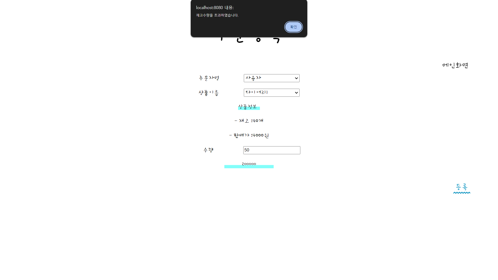
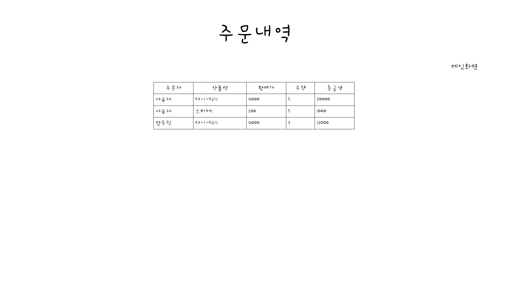
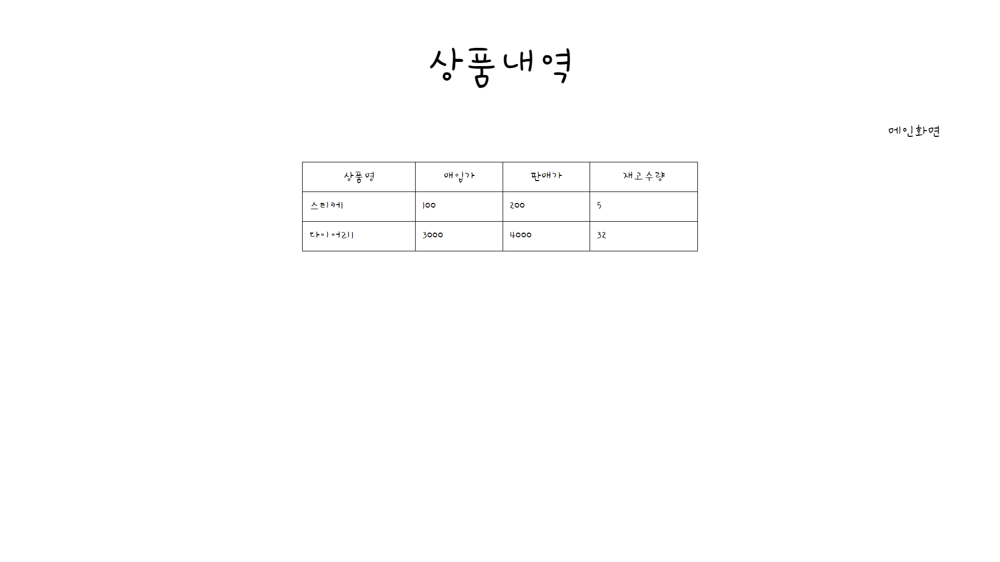

# 소품샵 토이 프로젝트

## 실행 방법 (clone 받은 프로젝트 경로 기준)
1. jar 배포파일 생성
   - (windows OS) ./gradlew.bat clean build 
   - (mac OS) ./gradlew clean build
2. jar 배포파일 실행 
   - java -jar .\build\libs\sopoomshop-0.0.1-SNAPSHOT.jar

## 유의 사항
- 실행 시 [JDK 21](https://www.oracle.com/kr/java/technologies/downloads/#java21) 이 권장됨 
- 서버 인메모리 DB 를 사용했기 때문에 서버 재기동 시 저정한 데이터가 휘발됨

## 테이블 다이어그램

## 화면 및 요청 스펙
### 1. [메인화면](src/main/resources/templates/main.html) (/)

### 2. [회원등록](src/main/resources/templates/members/CreateMemberForm.html) (/members/new)

|방식|경로|파라미터|타입|설명|
|------|---|---|---|---|
|POST|/members/create-member|name|text|이름|
|||address|text|주소|
|||phone|text|전화번호|

### 3. [회원조회](src/main/resources/templates/members/MemberList.html) (/members)

|방식|경로|파라미터|타입|설명|
|------|---|---|---|---|
|GET|/members|name|text|이름|
|||address|text|주소|
|||phone|text|전화번호|

### 4. [상품등록](src/main/resources/templates/items/CreateItemForm.html) (/items/new)

|방식|경로|파라미터|타입|설명|
|------|---|---|---|---|
|POST|/items/create-item|name|text|이름|
|||buyPrice|number|매입가|
|||salePrice|number|판매가|
|||stock|number|재고|

#### 4-1. 매입가 >= 판매가

### 5. [상품조회](src/main/resources/templates/items/ItemList.html) (/items)

|방식|경로|파라미터|타입|설명|
|------|---|---|---|---|
|GET|/items|name|text|이름|
|||buyPrice|number|매입가|
|||salePrice|number|판매가|
|||stock|number|재고|

### 6. [주문등록](src/main/resources/templates/orders/CreateOrderForm.html) (/orders/new)

|방식|경로|파라미터|타입|설명|
|------|---|---|---|---|
|POST|/orders/create-order|memberId|text|주문자ID|
|||itemId|text|상품ID|
|||quantity|number|수량|
|GET|/orders/new|memberId|text|사용자ID|
|||name|text|사용자명|
|||address|text|주소|
|||phone|text|전화번호|
|GET|/orders/new|itemId|text|상품ID|
|||name|text|상품명|
|||buyPrice|number|매입가|
|||salePrice|number|판매가|
|||stock|number|재고|

#### 6-1. 재고수량 초과 주문

### 7. [주문조회](src/main/resources/templates/orders/OrderList.html) (/orders)

|방식|경로|파라미터|타입|설명|
|------|---|---|---|---|
|GET|/orders/new|memberName|text|사용자명|
|||itemName|text|품목명|
|||salePrice|number|판매가|
|||quantity|number|수량|
|||total|number|총금액|

#### 7-1. 재고수량 차감

